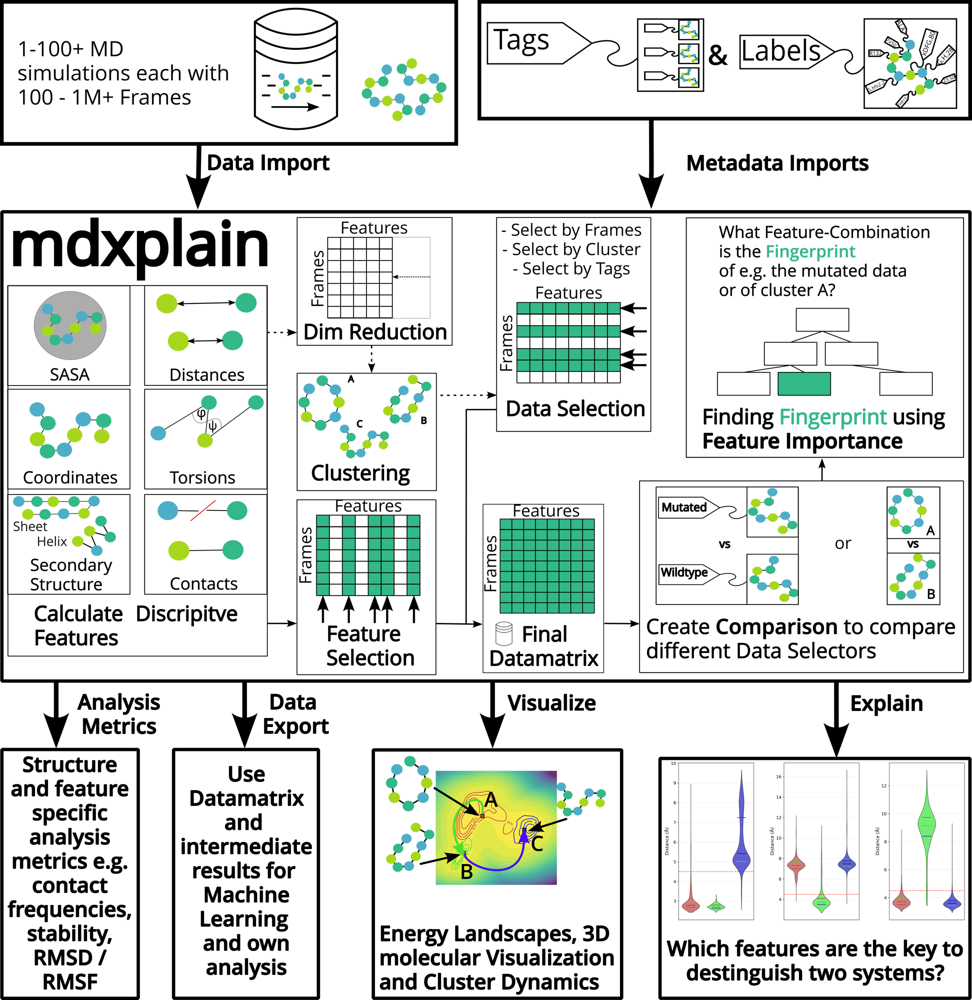

# mdxplain

A Python toolkit designed for **interpretable molecular dynamics trajectory analysis**, efficiently processing large datasets while delivering understandable results through machine learning models. It combines modular workflows with memory-efficient processing and decision trees to identify key conformational features and streamline complex analytical pipelines.

**Developer:** Maximilian Salomon (Software), Maeve Branwen Butler (ReadTheDocs Documentation)

**Version:** 0.1.0



- **Pipeline** and **PipelineManager**: Import of raw trajectory data (1-100+ simulations with 100 to over a million frames) along with metadata tags that classify different simulation conditions, mutations, or experimental variants.
    - **Descriptive features**: Feature extraction including distances, contacts, torsions, DSSP secondary structure, SASA, and atomic coordinates
    - **Dimensionality reduction**: PCA, Kernel PCA, or Diffusion Maps
    - **Clustering**: DPA, DBSCAN, or HDBSCAN to identify conformational states
    - **Feature selection**: Prioritize the most relevant features using metrics such as variance, range, or transitions
    - **Final datamatrix** with frames as rows and features as columns: Selection of specific data subsets based on frames, clusters, or tags
    - **Systematic comparison** of different datasets: E. g. mutated versus wildtype proteins
    - **Feature importance**: Analysis to identify system-specific molecular "fingerprints"
    - **Decision tree**-like visualizations: Highlights which feature combinations best separate systems, reframing **"what happened?"** to **"why did it happen?"**
- **Output**: Analysis metrics, data exports, and visualizations such as energy landscapes, 3D molecular structures, cluster dynamics, and decision trees

## Installation

### Prerequisites

- Python >= 3.8 (Python 3.12 recommended)
- Virtual environment manager (venv or conda)

### Quick Setup

mdxplain uses a Makefile for streamlined installation and development workflows:

```bash
# Clone repository
git clone https://github.com/maximilian-salomon/mdxplain.git
cd mdxplain

# Full setup with development tools and Jupyter (recommended)
make setup-full-env
source mdxplain-venv/bin/activate  # Linux/Mac

# Or using conda
make setup-conda-full-env
conda activate mdxplain
```

## Declaration of AI Tool Usage

This project was developed with AI assistance. For complete details about AI tools used, development process, and author contributions, see [AI_USAGE.md](AI_USAGE.md).

## License

This project is licensed under the GNU Lesser General Public License v3.0 (LGPL v3.0). See [LICENSE](LICENSE) for details.
