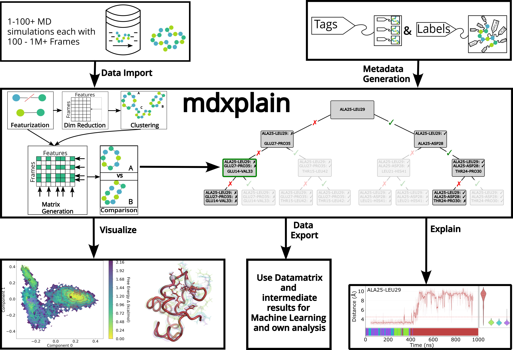

:orphan:

Welcome to mdxplain
===================

A Python toolkit designed for **interpretable molecular dynamics trajectory analysis**, efficiently
processing large datasets while delivering understandable results through machine learning models.
It combines modular workflows with memory-efficient processing and decision trees to identify key
conformational features and streamline complex analytical pipelines.

You can check and download the code on https://github.com/maximilian-salomon/mdxplain.

Quick Start Installation
------------------------

mdxplain uses a Makefile for streamlined installation and development workflows.
For detailed instructions, please refer to the `How to Install mdxplain
<./main_sites/how_to_install.rst>`_ guide.

.. code-block:: bash

   git clone https://github.com/maximilian-salomon/mdxplain.git
   cd mdxplain

Conda Environment (Recommended)
^^^^^^^^^^^^^^^^^^^^^^^^^^^^^^^

Create a new conda environment with production dependencies, Jupyter, and nglview:

.. code-block:: bash

   make setup
   conda activate mdxplain

Python Virtual Environment (Alternative)
^^^^^^^^^^^^^^^^^^^^^^^^^^^^^^^^^^^^^^^^

Create a new virtual environment with production dependencies, Jupyter, and nglview:

.. code-block:: bash

   make setup-venv
   source mdxplain-venv/bin/activate

Install in Existing Environment
^^^^^^^^^^^^^^^^^^^^^^^^^^^^^^^

Install mdxplain core package in your currently active environment:

.. code-block:: bash

   # Without Jupyter notebooks and nglview
   make install

   # With Jupyter notebooks and nglview
   make install-jupyter

Optional: PyMOL Installation
^^^^^^^^^^^^^^^^^^^^^^^^^^^^

PyMOL is not included in the standard installation to avoid compatibility issues due
to its complex system-level dependencies. If you need PyMOL for 3D structure visualization,
install it separately:

.. code-block:: bash

   make install-pymol

**Note:** For system-specific installation instructions, please refer to the
`official PyMOL documentation <https://www.pymol.org/>`_. Alternatively,
you can install PyMOL independently and load mdxplain's generated PyMOL scripts manually.

Workflow Example
----------------

This example demonstrates a complete analysis pipeline from trajectory loading to
interpretable results.

Setup and Data Loading
^^^^^^^^^^^^^^^^^^^^^^

.. code-block:: python

   from mdxplain import PipelineManager

   # Initialize pipeline and load trajectory data
   pipeline = PipelineManager(show_progress=False)
   pipeline.trajectory.load_trajectories(data_input="data/2RJY")
   pipeline.trajectory.add_labels(traj_selection="all")

Feature Extraction and Selection
^^^^^^^^^^^^^^^^^^^^^^^^^^^^^^^^

Extract molecular features and create a custom feature subset.

.. code-block:: python

   # Add distance and contact features
   pipeline.feature.add.distances()
   pipeline.feature.add.contacts(cutoff=4.5)

   # Create and configure feature selector
   pipeline.feature_selector.create("contacts_only")
   pipeline.feature_selector.add.contacts("contacts_only", "all")
   pipeline.feature_selector.select("contacts_only")

Dimensionality Reduction and Clustering
^^^^^^^^^^^^^^^^^^^^^^^^^^^^^^^^^^^^^^^

Reduce feature space and identify conformational states.

.. code-block:: python

   # Apply Contact Kernel PCA
   pipeline.decomposition.add.contact_kernel_pca(
      n_components=4,
      selection_name="contacts_only", 
      decomposition_name="ContactKernelPCA",
   )

   # Cluster using Density Peak Algorithm
   pipeline.clustering.add.dpa(
      "ContactKernelPCA", 
      Z=2.5,
      cluster_name="DPA_ContactKPC"
   )

Feature Importance Analysis
^^^^^^^^^^^^^^^^^^^^^^^^^^^

Identify which molecular features distinguish conformational states.

.. code-block:: python

   # Setup comparison groups from clusters
   pipeline.data_selector.create_from_clusters(
      group_name="cluster",
      clustering_name="DPA_ContactKPC"
   )

   # Create one-vs-rest comparison
   pipeline.comparison.create_comparison(
      name="cluster_comparison", 
      mode="one_vs_rest", 
      feature_selector="contacts_only", 
      data_selector_groups="cluster"
   )

   # Add decision tree for interpretability
   pipeline.feature_importance.add.decision_tree(
      comparison_name="cluster_comparison",
      analysis_name="feature_importance"
   )

Visualization
^^^^^^^^^^^^^

.. code-block:: python

   # Cluster membership visualization
   fig = pipeline.plots.clustering.membership(clustering_name="DPA_ContactKPC")

   # Free energy landscape
   fig = pipeline.plots.landscape(
      decomposition_name="ContactKernelPCA",
      dimensions=[0, 1]
   )

   # Decision tree visualization
   fig = pipeline.plots.feature_importance.decision_trees(
      feature_importance_name="feature_importance",
      short_layout=True
   )

   # Feature distribution comparison
   fig = pipeline.plots.feature_importance.violins(
      feature_importance_name="feature_importance"
   )

   # Time-resolved feature importance
   fig = pipeline.plots.feature_importance.time_series(
      feature_importance_name="feature_importance",
      membership_per_feature=True,
      clustering_name="DPA_ContactKPC"
   )

3D Visualization with PyMOL or NGLView
^^^^^^^^^^^^^^^^^^^^^^^^^^^^^^^^^^^^^^

.. code-block:: python

   pipeline.structure_visualization.feature_importance.create_pdb_with_beta_factors(
      structure_viz_name="structure_viz",
      feature_importance_name="feature_importance",
   )
   # Create PyMOL script and call pymol structure_viz.pml
   pipeline.structure_visualization.feature_importance.create_pymol_script(
      structure_viz_name="structure_viz"
   )
   # Or use nglview in Jupyter notebooks
   ui, view = pipeline.structure_visualization.feature_importance.visualize_nglview_jupyter(
      structure_viz_name="structure_viz",
   )
