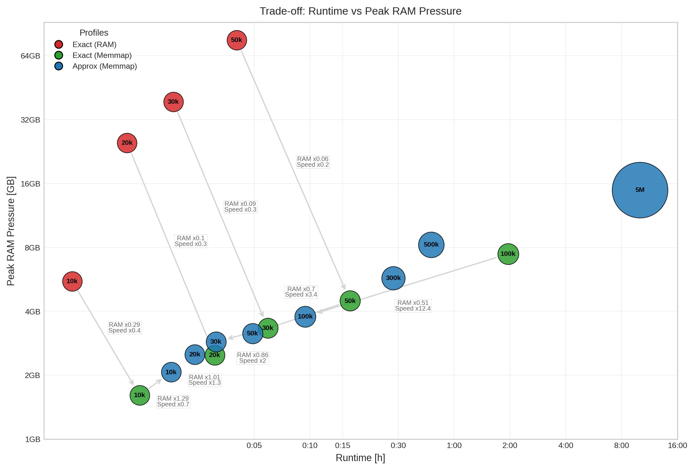
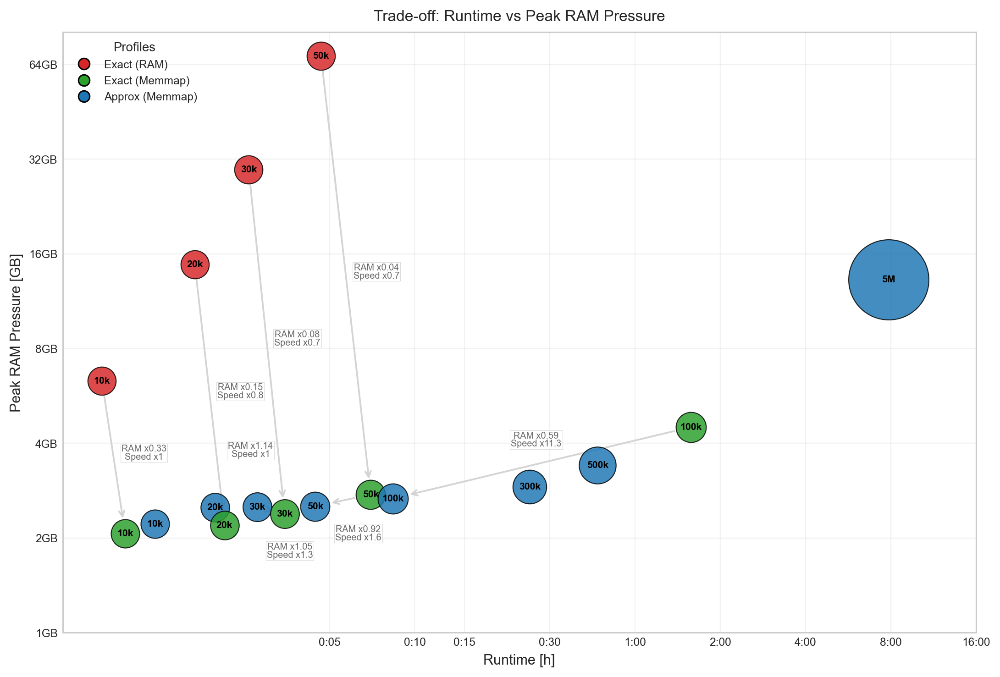

mdxplain Benchmarks
===================

System Specifications for Linux
^^^^^^^^^^^^^^^^^^^^^^^^^^^^^^^
The presented benchmarks for the Linux OS were performed on a representative research workstation, equipped with an AMD Ryzen Threadripper 2990WX (32 cores, 64 threads), 94GB of DDR4 RAM (2400 MHz), and an NVIDIA GeForce RTX 3090, using a 7.3TB Seagate IronWolf HDD as the primary I/O storage under Ubuntu 20.04.6 LTS. The typical sustained throughput for this drive is approximately 210 MB/s.

System Specifications for Windows
^^^^^^^^^^^^^^^^^^^^^^^^^^^^^^^^^
The presented benchmarks for the Windows OS were performed on a representative research workstation, equipped with an AMD Ryzen 9850X3D (8 cores, 16 threads), 64GB of DDR5 RAM (6000 MHz), and an NVIDIA GeForce RTX 4070Ti, using a 4TB Samsung 990 M.2 NVMe PCIe 4.0 SSD as the primary I/O storage under Windows 11. The typical sustained throughput for this drive is approximately 7 GB/s.

Benchmark Data Generation
^^^^^^^^^^^^^^^^^^^^^^^^^
The benchmark data were generated from the Villin headpiece reference simulation (10k frames, 1027 atoms) described above in simulation section of the SI.
Starting from the base dataset, we generated larger benchmark trajectories by frame-wise stacking (factors :math:`2\times, 3\times, 5\times, 10\times, 30\times, 50\times, 500\times`).
For stacked datasets, a small Gaussian perturbation (:math:`\sigma=0.01` nm, fixed seed) was added to avoid exact duplication artifacts while preserving the underlying structural distribution.
The perturbation is necessary to secure numerical stability in eigenvalue decompositions, for example of kernel PCA.

Benchmark Workflow and Configurations
^^^^^^^^^^^^^^^^^^^^^^^^^^^^^^^^^^^^^
The benchmark workflow follows the same end-to-end analysis structure as the example workflow described in the result section of the main text.
To isolate the effect of memory mapping and approximation strategies, we benchmarked three execution modes.
In all three modes, the same analysis workflow was used (feature generation, contact-based kernel principal component analysis, clustering, and downstream plotting/reporting).
It is exactly the same as the Tutorial notebook presented in the main text, except the following differences:

1. **Exact (RAM)** (``exact_ram``): This is the tutorial notebook, without memory mapping i.e. all major arrays are kept in main memory (RAM).

2. **Exact (Memmap)** (``exact_memmap``): This is the tutorial notebook, using memory mapping.

3. **Approx (Memmap)** (``approx_memmap``): This profile utilizes the same memory-mapped, chunked execution model as *Exact (Memmap)*, but introduces three levels of approximation to reduce computational overhead:

   - Kernel Approximation: The contact-kernel decomposition is performed via Nystroem approximation using the default landmark subset (:math:`N=2000`).
   - Clustering Acceleration: Density Peak Analysis (DPA) is run in ``knn_sampling`` mode with a target sampling fraction of 10%, bounded to 10k--50k frames. Thus, the effective sampling fraction can deviate from 10% depending on dataset size. For small datasets (:math:`\leq 10k` frames), the method falls back to standard DPA (no subsampling). The remaining frames are assigned using a k-nearest neighbors (kNN) classifier.
   - Decision Trees: The tree is calculated on a stratified subset of the data of maximal 100k data points. This avoids to have an uncontrolled amount of data in RAM, because decision trees of scikit-learn cannot be trained batch-wise.

Consequently, this profile transitions both memory management to an out-of-core model and the mathematical core from exact to approximate computation.

In short, *Exact (RAM)* vs. *Exact (Memmap)* isolates the impact of memory strategy, while *Exact (Memmap)* vs. *Approx (Memmap)* isolates the impact of approximation strategies.

Benchmark Scripts delivered by mdxplain
^^^^^^^^^^^^^^^^^^^^^^^^^^^^^^^^^^^^^^^
The full benchmark can be reproduced from the project root with ``make benchmark``.
This command runs data generation, all benchmark profiles, JSON packaging, and analysis export.
The resulting figures and tables are written to ``benchmark/export`` (including CSV summaries), so users can run the same benchmark on their own system.

Memory Measurement Method
^^^^^^^^^^^^^^^^^^^^^^^^^
To quantify memory pressure, we use a platform-specific pressure proxy instead of raw resident set size (RSS, RAM used by a process).
Raw RSS includes clean file-backed pages (e.g., memory-mapped trajectory files and other cacheable file pages), which can be reclaimed by the operating system under pressure.
Using RSS alone can therefore overestimate effective pressure, especially for out-of-core (``memmap``) runs.

**Linux Implementation:**
On Linux, we estimate non-cached memory from ``/proc/*/smaps_rollup`` over the full process tree as

.. math::

   M_{\mathrm{noncache}}^{\mathrm{Linux}}=
   \sum_{p}\max\!\left(0,\ \mathrm{RSS}_p-\mathrm{Shared\_Clean}_p-\mathrm{Private\_Clean}_p\right).

This removes clean file-backed mappings from RSS and emphasizes reclaim-resistant resident usage. [1]

**Windows Implementation:**
On Windows, we use the process-tree *Virtual Memory Size* (VMS) as the primary pressure metric:

.. math::

   M_{\mathrm{VMS}}^{\mathrm{Windows}}=\sum_{p}\mathrm{VMS}_p.

VMS represents the total virtual address space allocated to a process, including *Private Bytes* (unique, non-sharable memory like heap and stack) and all memory-mapped files. We use VMS because it remains stable under Windows' aggressive working-set trimming, whereas RSS can fluctuate significantly as the OS reclaims memory. For our out-of-core scenarios, VMS provides a conservative and reliable view of the total memory reservation and commit pressure. [2]

Because the Windows benchmark reports process-tree VMS (reflecting allocated virtual address space, including mapped regions), whereas the Linux benchmark uses a non-cached resident-memory proxy, the two memory metrics are not directly equivalent and absolute values are only comparable across platforms to a limited extent. Nevertheless, VMS provides a practical and conservative platform-specific proxy for memory pressure in our out-of-core workloads, particularly because it is more stable than RSS/working-set-based measures under Windows memory management. Likewise, the Linux metric is also a platform-specific proxy and provides a practical estimate of effective memory pressure by emphasizing reclaim-resistant resident memory rather than total physical memory usage.

**Data Collection:**
We sample these metrics during each pipeline step (:math:`0.2\,s` interval) and report step-wise and run-wise peaks: ``peak_non_cache_mb`` on Linux and ``peak_vms_mb`` on Windows, both referred to as **RAM Pressure**.
For transparency, we additionally store raw RSS peaks and platform-dependent diagnostics (e.g., Linux ``MemAvailable`` and cgroup usage/limits).

Benchmark results
^^^^^^^^^^^^^^^^^
To evaluate the efficiency and scalability of our implementation, we conducted comprehensive benchmarks on both Linux and Windows platforms.

Linux Benchmark
^^^^^^^^^^^^^^^

.. _fig_mdxplain_benchmark_linux:

   Benchmark of peak RAM pressure (MB) versus runtime for different computational profiles. The dataset is based on a Villin headpiece simulation scaled by a factor :math:`N` to increase the number of frames, with Gaussian noise added to the atomic coordinates to ensure numerical stability during eigenvalue decomposition. The bubble size reflects the cache size required for memory-mapped data, reaching approximately :math:`189\,GB` at 5M frames in the "Approx Memmap" configuration. The "Exact RAM" configuration is fastest at the smaller scales but exhibits quadratic memory growth, increasing peak RAM from about :math:`5.3\,GB` at 10k frames to about :math:`73.4\,GB` at 50k frames. The "Exact Memmap" configuration reduces peak RAM substantially, for example from :math:`5.3\,GB` to :math:`1.7\,GB` at 10k frames (:math:`\approx 0.29\times`) and from :math:`73.4\,GB` to :math:`7.5\,GB` at 50k frames (:math:`\approx 0.06\times`), at the cost of increased runtime and growing cache size due to disk-backed intermediate matrices. The "Approx Memmap" configuration further improves scalability, reducing runtime by approximately :math:`12.4\times` at 100k frames compared to the "Exact Memmap" approach and lowering peak RAM to about :math:`0.51\times`, while enabling processing up to 5M frames with about :math:`15.3\,GB` peak RAM.

The results of the Linux OS benchmark can be observed in :numref:`fig_mdxplain_benchmark_linux` and the corresponding :numref:`tab_benchmark_results_linux`.

Together, they illustrate the trade-off between runtime, peak RAM usage, and cache requirements across the three computational profiles "Exact RAM", "Exact Memmap", and "Approx Memmap" as the trajectory length increases.

The "Exact RAM" configuration constructs and diagonalizes the full kernel matrix in memory, resulting in quadratic memory scaling O(:math:`N^2`) and cubic eigendecomposition cost O(:math:`N^3`). This variant achieves the shortest runtimes for small trajectory sizes (e.g., 0:33 at 10k and 1:03 at 20k), but peak RAM increases rapidly with growing frame count and quickly becomes the limiting factor (from 5435 MB at 10k to 73377 MB at 50k, i.e., :math:`\sim 5.4\,GB` to :math:`\sim 73.4\,GB`).

The "Exact Memmap" configuration retains exact computations but stores large intermediate matrices on disk using memory mapping and chunkwise processing. This substantially reduces peak RAM pressure and enables the processing of larger trajectories (e.g., from 5435 MB to 1744 MB at 10k, :math:`\approx 0.32\times`, and from 73377 MB to 4784 MB at 50k, :math:`\approx 0.07\times`). However, the fundamental algorithmic complexity remains identical to the in-memory variant. While memory mapping effectively reduces RAM pressure, the resulting runtime increase arises from the sequential evaluation of chunks and the associated I/O operations, which introduce additional computational overhead compared to fully in-memory execution (e.g., 15:45 at 50k and 110:29 at 100k for "Exact Memmap", compared to 4:05 at 50k for "Exact RAM"). In addition, the required cache size grows with trajectory length because intermediate matrices still scale quadratically (e.g., 3902 MB at 100k). Overall, this represents a deliberate trade-off that preserves exact results while enabling the analysis of larger trajectories.

In contrast, the "Approx Memmap" configuration modifies the scaling behavior by combining a Nystroem approximation for kernel PCA with kNN-accelerated DPA clustering. This reduces both computational complexity and memory requirements, leading to pronounced runtime improvements at larger scales. From moderate trajectory sizes onward, it becomes the much faster than the "Exact Memmap" configuration while further reduce RAM growth (e.g., 4:59 vs. 15:45 at 50k and 9:59 vs. 110:29 at 100k compared to "Exact Memmap", with peak RAM 3930 MB vs. 7515 MB at 100k, :math:`\approx 0.52\times`). Note, that with increasing size, the runtime also get closer to these from the "Exact RAM" configuration. For datasets exceeding 100k frames, additional stratified sampling in the decision tree stage limits the effective training set size, further stabilizing runtime and memory consumption and improving overall scalability. This enables processing up to 5M frames with 15267.20 MB peak RAM (:math:`\sim 15.3\,GB`) in roughly 10 hours.

.. _tab_benchmark_results_linux:

.. table:: Benchmark of peak RAM pressure against runtime for various computation configurations on Linux OS. The dataset is based on a Villin headpiece simulation, scaled by a factor N to vary the frame count, with gaussian noise added to the atomic positions to ensure numerical stability during eigenvalue decomposition. The "Exact RAM" configuration performs full in-memory kernel construction and exhibits quadratic memory scaling with increasing frame count. The "Exact Memmap" configuration preserves the exact algorithm but stores large intermediate matrices on disk, substantially reducing peak RAM usage at the cost of increased runtime and larger cache requirements due to disk I/O and growing intermediate matrices. The "Approx Memmap" configuration applies the Nystroem method for kernel PCA and employs kNN-accelerated DPA clustering, reducing both computational complexity and memory usage and yielding substantial runtime improvements for large trajectories. For datasets exceeding 100k frames, stratified sampling is additionally applied in the decision tree stage to limit the effective data size, further improving runtime and memory efficiency. Benchmarks were performed up to the maximum feasible trajectory size for each configuration, reaching 5M frames for the "Approx Memmap" setup.

   .. list-table::
      :class: benchmark-table
      :header-rows: 1
      :widths: 16 16 14 10 12 14 14 14

      * - Profile
        - | Approxi-
          | mation
        - | Mem-
          | map
        - Frames
        - Time
        - | RAM
          | Pres.
          | (MB)
        - | Cache
          | Size
          | (MB)
        - | Archive
          | Size
          | (MB)
      * - Approx (Memmap)
        - | DPA kNN
          | Tree subset
          | Nystroem
        - Yes
        - 10k
        - 00:01:41
        - 2173
        - 396
        - 287
      * - Approx (Memmap)
        - | DPA kNN
          | Tree subset
          | Nystroem
        - Yes
        - 20k
        - 00:02:21
        - 2721
        - 783
        - 573
      * - Approx (Memmap)
        - | DPA kNN
          | Tree subset
          | Nystroem
        - Yes
        - 30k
        - 00:03:07
        - 3125
        - 1172
        - 860
      * - Approx (Memmap)
        - | DPA kNN
          | Tree subset
          | Nystroem
        - Yes
        - 50k
        - 00:04:59
        - 3410
        - 1960
        - 1434
      * - Approx (Memmap)
        - | DPA kNN
          | Tree subset
          | Nystroem
        - Yes
        - 100k
        - 00:09:59
        - 3930
        - 3896
        - 2867
      * - Approx (Memmap)
        - | DPA kNN
          | Tree subset
          | Nystroem
        - Yes
        - 300k
        - 00:28:12
        - 5883
        - 11666
        - 8602
      * - Approx (Memmap)
        - | DPA kNN
          | Tree subset
          | Nystroem
        - Yes
        - 500k
        - 00:45:02
        - 8452
        - 19416
        - 14326
      * - Approx (Memmap)
        - | DPA kNN
          | Tree subset
          | Nystroem
        - Yes
        - 5M
        - 10:01:50
        - 15267
        - 194259
        - 143278
      * - Exact (Memmap)
        - No
        - Yes
        - 10k
        - 00:01:11
        - 1745
        - 393
        - 287
      * - Exact (Memmap)
        - No
        - Yes
        - 20k
        - 00:02:58
        - 2682
        - 788
        - 573
      * - Exact (Memmap)
        - No
        - Yes
        - 30k
        - 00:05:43
        - 3582
        - 1179
        - 860
      * - Exact (Memmap)
        - No
        - Yes
        - 50k
        - 00:15:45
        - 4784
        - 1961
        - 1434
      * - Exact (Memmap)
        - No
        - Yes
        - 100k
        - 01:50:29
        - 7515
        - 3902
        - 2867
      * - Exact (RAM)
        - No
        - No
        - 10k
        - 00:00:33
        - 5435
        - 4
        - 133
      * - Exact (RAM)
        - No
        - No
        - 20k
        - 00:01:03
        - 24085
        - 7
        - 266
      * - Exact (RAM)
        - No
        - No
        - 30k
        - 00:01:52
        - 37550
        - 16
        - 399
      * - Exact (RAM)
        - No
        - No
        - 50k
        - 00:04:05
        - 73377
        - 41
        - 676

Windows Benchmark
^^^^^^^^^^^^^^^^^
The results for the windows OS benchmark can be found in :numref:`fig_mdxplain_benchmark_windows` and the corresponding :numref:`tab_benchmark_results_windows`.

Overall, the same qualitative scaling trends as in the Linux benchmark are observed: "Exact RAM" is fastest at the smallest trajectory sizes (e.g., 0:48 at 10k frames), but its peak RAM usage increases rapidly and becomes the limiting factor (from 6100 MB at 10k to 65737 MB at 50k). "Exact Memmap" substantially reduces peak RAM (e.g., 2244 MB at 10k and 2979 MB at 50k), but incurs longer runtimes at larger scales (6:53 at 50k and 89:08 at 100k). "Approx Memmap" again provides the best scalability and becomes clearly runtime-dominant from moderate trajectory sizes onward (e.g., 4:29 vs. 4:41 compared to "Exact RAM" at 50k and 8:54 vs. 89:08 at 100k compared to "Exact Memmap"), while enabling processing up to 5M frames with 13554.16 MB peak RAM in less then 8h.

Compared to the Linux benchmark, the Windows measurements show similar overall behavior but noticeable differences in absolute runtime and memory values. These deviations are expected and likely reflect operating-system-dependent differences in memory management and file-system I/O behavior, which particularly affect memory-mapped workloads and chunkwise processing. In practice, this means that the relative ranking of the configurations remains stable, while absolute performance numbers should be interpreted as platform-specific and are only comparable across platforms to a limited extent. Nevertheless, the Windows memory values remain a useful platform-specific proxy for practical resource requirements and reflect the relative scaling trends across configurations.

.. _fig_mdxplain_benchmark_windows:

   Benchmark of peak RAM pressure (MB) versus runtime for different computational profiles on Windows. The dataset is based on a Villin headpiece simulation scaled by a factor :math:`N` to increase the number of frames, with Gaussian noise added to the atomic coordinates to ensure numerical stability during eigenvalue decomposition. The bubble size reflects the cache size required for memory-mapped data, reaching approximately :math:`189\,GB` at 5M frames in the "Approx Memmap" configuration. The "Exact RAM" configuration is fastest at the small scales (e.g., 0:48 at 10k frames) but exhibits strong memory growth, increasing peak RAM from about :math:`6.1\,GB` at 10k frames to about :math:`65.7\,GB` at 50k frames. The "Exact Memmap" configuration reduces peak RAM substantially, for example from :math:`6.1\,GB` to :math:`2.2\,GB` at 10k frames (:math:`\approx 0.33\times`) and from :math:`65.7\,GB` to :math:`3.0\,GB` at 50k frames (:math:`\approx 0.04\times`), at the cost of increased runtime and growing cache size due to disk-backed intermediate matrices. The "Approx Memmap" configuration further improves scalability, reducing runtime by approximately :math:`11.3\times` at 100k frames compared to the "Exact Memmap" approach (8:54 vs. 89:08) and lowering peak RAM to about :math:`0.59\times` (2767 vs. 4552 MB), while enabling processing up to 5M frames with about :math:`13.6\,GB` peak RAM in less then 8h.

.. _tab_benchmark_results_windows:

.. table:: Benchmark of peak RAM pressure against runtime for various computation configurations on Windows 11 OS. The dataset is based on a Villin headpiece simulation, scaled by a factor N to vary the frame count, with gaussian noise added to the atomic positions to ensure numerical stability during eigenvalue decomposition. The "Exact RAM" configuration performs full in-memory kernel construction and exhibits quadratic memory scaling with increasing frame count. The "Exact Memmap" configuration preserves the exact algorithm but stores large intermediate matrices on disk, substantially reducing peak RAM usage at the cost of increased runtime and larger cache requirements due to disk I/O and growing intermediate matrices. The "Approx Memmap" configuration applies the Nystroem method for kernel PCA and employs kNN-accelerated DPA clustering, reducing both computational complexity and memory usage and yielding substantial runtime improvements for large trajectories. For datasets exceeding 100k frames, stratified sampling is additionally applied in the decision tree stage to limit the effective data size, further improving runtime and memory efficiency. Benchmarks were performed up to the maximum feasible trajectory size for each configuration, reaching 5M frames for the "Approx Memmap" setup.

   .. list-table::
      :class: benchmark-table
      :header-rows: 1
      :widths: 16 16 14 10 12 14 14 14

      * - Profile
        - | Approxi-
          | mation
        - | Mem-
          | map
        - Frames
        - Time
        - | RAM
          | Pres.
          | (MB)
        - | Cache
          | Size
          | (MB)
        - | Archive
          | Size
          | (MB)
      * - Approx (Memmap)
        - | DPA kNN
          | Tree subset
          | Nystroem
        - Yes
        - 10k
        - 00:01:10
        - 2385
        - 395
        - 287
      * - Approx (Memmap)
        - | DPA kNN
          | Tree subset
          | Nystroem
        - Yes
        - 20k
        - 00:01:58
        - 2721
        - 785
        - 573
      * - Approx (Memmap)
        - | DPA kNN
          | Tree subset
          | Nystroem
        - Yes
        - 30k
        - 00:02:47
        - 2727
        - 1176
        - 860
      * - Approx (Memmap)
        - | DPA kNN
          | Tree subset
          | Nystroem
        - Yes
        - 50k
        - 00:04:29
        - 2737
        - 1967
        - 1434
      * - Approx (Memmap)
        - | DPA kNN
          | Tree subset
          | Nystroem
        - Yes
        - 100k
        - 00:08:54
        - 2767
        - 3898
        - 2867
      * - Approx (Memmap)
        - | DPA kNN
          | Tree subset
          | Nystroem
        - Yes
        - 300k
        - 00:25:29
        - 2975
        - 11670
        - 8602
      * - Approx (Memmap)
        - | DPA kNN
          | Tree subset
          | Nystroem
        - Yes
        - 500k
        - 00:44:15
        - 3491
        - 19437
        - 14326
      * - Approx (Memmap)
        - | DPA kNN
          | Tree subset
          | Nystroem
        - Yes
        - 5M
        - 07:51:28
        - 13554
        - 194300
        - 143278
      * - Exact (Memmap)
        - No
        - Yes
        - 10k
        - 00:00:57
        - 2244
        - 393
        - 287
      * - Exact (Memmap)
        - No
        - Yes
        - 20k
        - 00:02:07
        - 2385
        - 789
        - 573
      * - Exact (Memmap)
        - No
        - Yes
        - 30k
        - 00:03:26
        - 2594
        - 1180
        - 860
      * - Exact (Memmap)
        - No
        - Yes
        - 50k
        - 00:06:53
        - 2979
        - 1962
        - 1434
      * - Exact (Memmap)
        - No
        - Yes
        - 100k
        - 01:29:08
        - 4552
        - 3904
        - 2867
      * - Exact (RAM)
        - No
        - No
        - 10k
        - 00:00:48
        - 6100
        - 4
        - 133
      * - Exact (RAM)
        - No
        - No
        - 20k
        - 00:01:41
        - 14265
        - 7
        - 266
      * - Exact (RAM)
        - No
        - No
        - 30k
        - 00:02:36
        - 28568
        - 17
        - 399
      * - Exact (RAM)
        - No
        - No
        - 50k
        - 00:04:41
        - 65737
        - 43
        - 676

References
^^^^^^^^^^

[1] A. M. Bishop, The/proc file system and procmeter, Linux Journal 1997 (36es) (1997) 5–es.

[2] D. A. Solomon, M. E. Russinovich, A. Ionescu, Windows internals, Microsoft Press, 2009.
